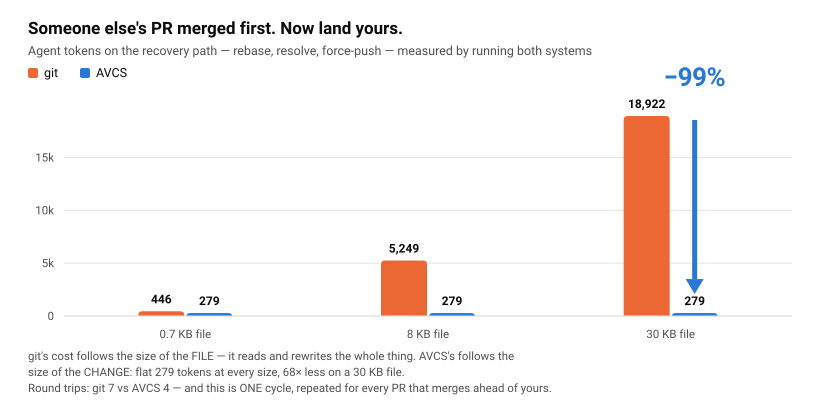

# AVCS — Agentic Version Control System

*An AI-native version control system for humans and AI agents working concurrently.*

[](https://github.com/izagood/avcs/actions/workflows/ci.yml)


**An agent should not spend its context on version control.** That is the whole design
goal, and it is measured rather than asserted — here is what the same work costs an agent:

| What an agent pays for | git / the full surface | AVCS |
|---|---|---|
| Landing a change after someone else's PR merged first (30 KB module) | **18,922** tokens | **279** tokens — *99% less* |
| Round trips to finish that recovery | 7 | 4 |
| Tool schema, paid on **every** session | ≈8.8k tokens (39 tools) | ≈3.5k tokens (13, `--profile core`) |
| What a same-line collision hands the model | the whole file, with conflict markers | one object naming the two contending operations |

<picture>
  <source media="(prefers-color-scheme: dark)" srcset="docs/assets/rebase-token-cost-dark.svg">
  
</picture>

git's recovery cost tracks the size of the **file** — a conflict is bytes inside it, so the
agent reads the whole module and writes the whole module back to change one line. AVCS's
tracks the size of the **change**: a conflict is an object naming the two contending
operations, so it stays flat as the file grows. There is also no branch to rewrite and
nothing to force-push, which is why the round trips differ — and that is *one* cycle,
repeated for every PR that merges ahead of yours. Across the file sizes measured the saving
is 37–99%.

None of this is a compression trick bolted on afterwards. It falls out of storing the
operation graph instead of snapshots: there is no rebase to perform, so there is nothing to
re-read. Method, caveats and the harness that produced the rebase numbers:
[avcs-demo → what it costs an agent in tokens](https://github.com/izagood/avcs-demo#what-it-costs-an-agent-in-tokens).
The schema figures are the advertised MCP surface itself — 35 KB of JSON against 14 KB, at
the usual ≈4 bytes per token.

> Git records **when** the code changed.
> AVCS records **who changed it, with what intent, on what evidence, and through which conflict decisions** the code reached its current state.

AVCS is a new, deliberately Git-incompatible version control system built for a world where humans and **many AI agents edit the same codebase concurrently**. It drops the commit / branch / merge / conflict-marker model and instead stores **intent**, **session**, **operation**, **evidence**, and **decision** as first-class objects. The code tree is not the source of truth — it is a **projection** computed by deterministically *reducing* the operation graph:

```
state = reduce(base, operationDAG, decisions, policy, materializer)
```

The same objects + the same policy + the same materializer produce the same tree on any replica. Merging is not text selection; it is a pure, deterministic reduction.

> **Status:** research prototype. The implementation is real and test-covered, but every phase is built to a *working-MVP depth* (language-neutral text 3-way merge, ed25519 signing). Structure-aware merge, semantic-break detection, multi-signature trust, and hardened distributed sync are tracked on the [roadmap](docs/07-roadmap.md).

**Jump in:** [install](#install) · [your first five minutes](#your-first-five-minutes-no-server-no-git-required) · [work against a server](#work-against-a-server) · [connect an agent over MCP](#connect-agents-mcp) · [agent quickstart walkthrough](docs/25-agent-quickstart.md)

**See it run first:** [`izagood/avcs-demo`](https://github.com/izagood/avcs-demo) — a runnable
demo of the question this design answers: *what happens when two agents edit the same file at
the same time?* One `./demo.sh` walks a stale-head land that is absorbed instead of rejected,
a same-file auto-merge with no rebase, and a same-line collision that becomes a signed
decision rather than conflict markers.

## Why not a layer on top of git?

Every "AI + git" tool eventually stores the agent's context *beside* the history — commit
trailers, PR comments, sidecar JSON. AVCS exists because these objects have to be
**load-bearing** — consumed by the merge machinery itself — and bolted onto git they can't be:

- **Evidence must gate merging.** git happily merges a behavior change with no passing
  test. In AVCS that change is graded **L3 — blocked** by the reducer until *trusted*
  evidence lands, and an operation's own author vouching for it does not count.
- **Decisions must outlive the merge.** `git merge` resolves a conflict by emitting bytes;
  the choice and its rationale evaporate. An AVCS `decision` is a signed object —
  recallable later, and prior decisions bias future auto-resolution.
- **Concurrent edits must not degrade into conflict markers.** Two agents editing one
  file meet a deterministic policy reduction (L0–L4 below), not `<<<<<<<` in the tree
  plus a human holding the pieces.
- **Intent must travel with the work.** A trailer is inert text. An `intent` (goal +
  constraints + allowed scope) is what sessions open against, what leases and contention
  checks are scoped by, and what `avcs.context.build` hands the next agent.

git stores snapshots and leaves the merge to text selection; AVCS stores the operation
graph and makes the merge a computation over intent, evidence, and decisions. That is why
it is deliberately git-**incompatible** — these objects are the engine, not metadata.
(git interop still exists, as a bridge: [docs/14](docs/14-git-bridge.md), [docs/20](docs/20-workspace-bridge.md).)

## Core principles

| # | Principle | Contrast with Git |
|---|-----------|-------------------|
| 1 | **Operations are history**, not commits | A commit is merely a checkpoint over many operations |
| 2 | **Identity is the entity ID**, not the file path | Rename + edit can auto-merge |
| 3 | **Merge is a deterministic reduction**, not text selection | No conflict markers |
| 4 | **A conflict is a first-class `decision` object**, not a broken file | The rationale stays in history |
| 5 | **AI output is a proposed operation with attached evidence**, not trusted code | A behavior change with no test cannot be `accepted` |
| 6 | **Code never defaults to last-write-wins** | Precedence is decided by policy |

## How it works

Every meaningful thing is a content-addressed, append-only object. Code is a *projection* over the operation DAG, never stored as commits.

| Object | Role |
|--------|------|
| `intent` | Why a change is being made (goal + constraints + allowed scope) |
| `session` | An agent/human work episode against an intent |
| `operation` | A single semantic change unit — the real history |
| `evidence` | Machine-checkable proof (test / typecheck / lint / scan) attached to operations |
| `decision` | A recorded resolution of a conflict or design choice |
| `checkpoint` | A verified (ops + policy + materializer) state vector — replaces a commit |
| `view` | A declarative query over the operation graph — replaces a branch |
| `release` | A signed, provenance-bearing checkpoint — replaces a tag |
| `policy` | The deterministic merge rules the reducer is parameterized by |

…plus `blob` for raw content and the governance objects (`lease`, `membership`, `protection`, `promotion`, `redaction`, `override`, `approval`, `line`, `integration`) used by the multi-machine and security phases.

## Conflict resolution levels

AVCS never falls back to last-write-wins for code. Contending operations are graded and resolved with a recorded rationale:

- **L0 / L1** — different entities, or **disjoint line regions** in the same file → **auto-merge**
- **L2** — concurrent edits that overlap the same line region → **policy auto-decision** (human-preferred, trust-weighted); the auto-decision is itself recorded in `autoDecisions`
- **L3** — a behavior change with no *trusted* evidence → **blocked**
- **L4** — a public-API break → **requires a human decision**, routed to the scope's owners

Evidence trust matters: an operation's own author cannot vouch for it. Evidence-gating and the passing-test bonus only count evidence produced by a *non-authoring, trusted* actor (CI bot / human).

## What works today

The reducer and policy engine are the foundation; the higher phases build distributed collaboration, security, and observability on top.

**Foundation (Phases 1–6)**

- **Storage core** — append-only, content-addressed object store (`.avcs/objects`)
- **Deterministic reducer + policy engine** — the L0–L4 conflict grading above, with a priority ladder, bounded reliability nudges, and auditable auto-decisions
- **Language-neutral text merge** (Phase 2) — a deterministic N-way line-level 3-way merge (`src/merge/merge3.ts`), so edits to disjoint regions of one file auto-merge regardless of language; overlapping edits become a policy-resolved conflict region. No language parsing in the core
- **Cryptographic trust** (Phase 3) — ed25519-signed evidence/decision; forged signatures fail the trust gate. Real validation runner, `WorkLease`, `RepairContext`
- **Decision memory** (Phase 4) — recallable prior human decisions (`recallDecisions`) and distilled "learned policies" that bias future auto-resolution
- **Policy depth** (Phase 5) — code-owner routing and bounded reliability learning
- **Release & provenance** (Phase 6) — verified checkpoints + CycloneDX SBOM + signed artifacts

**Collaboration, scale & security (Phases 7–12)**

- **Phase 7 — multi-machine:** membership/roles (signed key federation), `pull` (object gossip; two replicas converge to the same `treeHash`), protection + `finalize` CAS (non-fast-forward rejected, so a stale push can't overwrite fresh history)
- **Phase 8 — lineage:** long-lived divergent lines (e.g. v1.x ∥ v2.x, same path, different content, zero conflict), `portOp` (backport = cherry-pick)
- **Phase 9 — scale:** entity index, `materializeAt` (time travel), chunked large-blob storage with dedup
- **Phase 10 — observability:** `blame` (who/why), `logP`, deterministic `bisect`, `diff`
- **Phase 11 — external contributions:** quarantine tier + `promote` + untrusted-CI gate
- **Phase 12 — security:** `redact` (byte-eviction of leaked secrets, oid preserved), break-glass `override`, forward-only rollback
- **Local undo** ([docs/23](docs/23-local-undo.md)) — `avcs undo [--last | <op-oid>…] [--purge] [--no-git]`: drop local ops from the view, and with `--purge` evict the bytes they uniquely reference. Refuses once the ops have been pushed, because that case belongs to admin-gated `redact`. In a git-bridged repo `--purge` clears the **git** copy too — but only where it can prove the rewrite is safe and local (nothing on a remote, the commits at the tip, no other work in them, a clean tree); anywhere else it still does the AVCS side and names precisely what is left and the one command that fits, up to and including "rotate the credential, it is already published"
- **The working tree is genuinely derived** — `checkout` records what it projected
  (`.avcs/projection.json`, path → blob oid) and, on the next projection, removes the files
  the target view no longer contains. Files it never wrote — build output, ignored files,
  anything you just created — are untouched, and a projected file you have since edited is
  kept and named in a notice rather than silently overwritten. Switching views therefore
  yields *that view*, not the union of every view projected before it

Branches become **views**, commits become **checkpoints**, tags become **releases**. Agents drive AVCS through a first-class **MCP server** (39 tools, or 13 with `--profile core`); humans use the **CLI**. Since Phase 14 the server runs an **integration queue** (`avcs submit`, `POST /integrate`): a stale submission is never told "head moved — pull first" — the server re-reduces the frontier union on the submitter's behalf, and the outcome is always a verdict (`advanced` | `conflict` repair packet | `needs_evidence` — one validation run, never a redo | `queued`). Since Phase 15 replicas converge **live** (`GET /events` long-poll, `avcs sync --watch`, contention early-warning), and Phase 16 completed the MCP surface: `avcs.sync.land` lands work in one call, `avcs.context.build` assembles bounded working context with deterministic truncation, and subscribable resources notify a client when the head moves — see [docs/17](docs/17-sync-convergence.md) and [docs/18](docs/18-mcp-first-class.md). The behavior is pinned by an 827-test contract suite (`test/*.test.ts`, all green) and `tsc` is clean.

## Install

Requires **Node ≥ 22.6** — AVCS runs TypeScript directly via type stripping, so there is **no build step and zero runtime dependencies**.

AVCS is published on npm as [`@izagood/avcs`](https://www.npmjs.com/package/@izagood/avcs). Install it globally to get the `avcs` command on your `PATH`:

```bash
npm install -g @izagood/avcs
```

Or run it without installing, straight from the registry:

```bash
npx @izagood/avcs version
```

### Your first five minutes (no server, no git required)

AVCS is local-first: a repo on your disk is a complete VCS — history, blame, undo,
releases — with no server and no git anywhere. In an existing project directory:

```bash
avcs init .                        # create the repo (inside a git repo is fine — .avcs is git-ignored)
avcs import . -m "initial import"  # bring the existing tree in as operations

# …edit files as usual, then record the change:
avcs commit -m "add mul()"         # authors operations for your working-tree changes

avcs status                        # operation / conflict summary
avcs log                           # operation history
avcs blame file:src/math.js        # who owns this file and why (entity key = file:<path>)
avcs conflicts                     # decisions a human still owes
avcs decide <conflict-id> --choose <op-oid> --reason "…"   # …and pay one: a signed decision


avcs undo --last                   # take the last operation back out of the view…
avcs checkout                      # …and re-project the working tree from it
```

Two things to notice: `commit` is not a git commit — it authors semantic *operations*,
the real history; and the working tree is a *projection* you re-materialize with
`checkout`, not the source of truth. `avcs help` lists every command.

### Signing identity

An avcs identity belongs to you and this machine, not to one checkout — the same scope as
`~/.ssh` or `~/.gnupg`. Provision it once and every repo on the box can sign with it:

```bash
avcs key provision human:you    # writes ~/.avcs/private/human:you.json (0600, dir 0700)
avcs key ls                     # who this machine can sign as, and which keystore each came from
avcs key import <key-file>      # put an existing identity on a NEW machine
```

The keystore is `$AVCS_CONFIG_HOME`, else `$XDG_CONFIG_HOME/avcs`, else `~/.avcs`. A repo may
keep its own key in `<store>/private/` to sign as a *different* actor (a CI checkout, a second
identity); that override is read first. See [12 — Local production](docs/12-local-production.md#개인키-보관소-machine-level-keystore).

Your **id** is your identity — trust, keys and governance key on it. For attribution and
contact, set a display name and email the git way; they ride in every operation you author
(so blame and history can show and reach you) but never gate anything:

```bash
avcs config user.name  "Ada Lovelace"
avcs config user.email "ada@example.com"
avcs config actor      "human:ada"      # the id commits author as (else your sole key / AVCS_ACTOR)
avcs config                              # show what is set
```

These live in `.avcs/config.json`; `AVCS_AUTHOR_NAME` / `AVCS_AUTHOR_EMAIL` / `AVCS_ACTOR`
override per invocation.

### Work against a server

A repo stays useful with no server at all. Once there is one — [`avcs serve`](#build-your-own-server),
[avcs-server](https://github.com/izagood/avcs-server), or any conforming implementation — the
whole exchange is a handful of commands:

```bash
avcs clone https://your.server/acme/web .      # fetch the graph AND project a working tree
avcs clone https://your.server/acme/web . --at <checkpoint>   # …at one exact checkpoint
avcs sync                                      # pull + push against the remote it recorded
avcs sync --watch                              # live convergence: long-poll + contention early warning
avcs land -m "add mul()"                       # push + checkpoint + integrate, in one step
```

`land` is the one to reach for. A stale head is absorbed by the server's integration queue
rather than bounced back as "head moved — pull first", so the outcome is `landed` or a
conflict packet for a human to decide — never a redo. `avcs remote add <name> <url>`
registers additional servers; `avcs sync <name>` picks one.

**Reading from CI, without handing out a signing key.** The default credential is an
`AVCS-Sig` signature over the canonical request, which covers the method and the body — a
captured read credential cannot be replayed as a write. That is the right default, and a
poor fit for an ephemeral reader. So a *read* also accepts a bearer token:

```bash
AVCS_HUB_TOKEN=… avcs clone https://your.server/acme/web .
```

The token is read-only by construction: the write path takes no token parameter at all, so
a leaked variable can clone but can never push, finalize, or rewrite policy. A held signing
key always wins over the token, so a signed reader is never silently downgraded. The token's
format, lifetime and scope belong to the server — see [docs/26](docs/26-hub-protocol.md).

### Connect agents (MCP)

Agents drive AVCS through its MCP server. Once `avcs` is installed, register it with the Claude Code CLI:

```bash
avcs mcp install            # runs `claude mcp add avcs -- avcs mcp` for you (scope: user)
claude mcp list             # confirm "avcs" is Connected
```

`avcs mcp` itself is the stdio server agents spawn (target repo = `$AVCS_REPO`, else the cwd). To register by hand — or for any other MCP client — point it at `avcs mcp`:

```bash
claude mcp add avcs -- avcs mcp
```

The MCP SDK ships as an optionalDependency, so a normal install includes it; no extra step needed.

Every tool answers compactly by default — pretty-printing is an opt-in `verbose` flag on the
call, because whitespace an agent never reads is still whitespace it pays for.

**The loop an agent runs** — five moves, and landing is one call:

```
avcs.guide                                  # the loop, the rules, error recovery
avcs.context.build   { intentOid }          # provenance, prior decisions, live risks
avcs.operation.propose { path, content }    # never write final files directly
avcs.validate.run + avcs.evidence.attach    # a behaviour change needs passing evidence
avcs.sync.land       { by }                 # push + checkpoint + integrate → landed | conflict
```

`sync.land` is the point: a stale head is absorbed for you, so the outcome is either `landed` or a conflict packet for a human — never "pull and redo". Add `--profile core` to advertise only these 13 tools instead of all 39 — the schema an agent is handed drops from 35 KB to 14 KB, on every session:

```bash
claude mcp add avcs -- avcs mcp --profile core
```

To upgrade later, re-run `npm install -g @izagood/avcs@latest`; to remove it, `npm uninstall -g @izagood/avcs` (your repo data is left intact).

### Install from source

Prefer to track the latest `main`, or hack on AVCS itself? The bundled `install.sh` clones the repo and wires up an `avcs` launcher that points back at the checkout, so updating is just `git pull` — no reinstall needed.

```bash
curl -fsSL https://raw.githubusercontent.com/izagood/avcs/main/install.sh | bash
```

That one-liner clones the repo to `~/.local/share/avcs` (override with `--dir`/`AVCS_HOME`) and installs an `avcs` launcher to `~/.local/bin`. Re-running it updates the checkout in place. Already have a clone? Run the installer from inside it instead:

```bash
git clone https://github.com/izagood/avcs.git && cd avcs
./install.sh
```

The launcher lands in `~/.local/bin` (override with `--bin-dir <dir>` or `AVCS_BIN_DIR`). If `~/.local/bin` isn't on your `PATH` yet, the installer prints the line to add.

Other install-from-source options:

```bash
./install.sh --bin-dir /usr/local/bin   # system-wide (may need sudo)
./install.sh --name avcs-dev            # install under a different command name
./install.sh --dir ~/src/avcs --ref v1  # one-liner mode: clone dir + ref to install
./uninstall.sh                          # remove the launcher (data is left intact)
```

If `node` isn't on your `PATH` at runtime, point the launcher at one with `AVCS_NODE=/path/to/node`.

## Use as a library (`@izagood/avcs`)

A hosting server (e.g. avcshub) can depend on the AVCS core as a versioned package. Development and tests run the raw `.ts` via type stripping, but `npm publish` ships a `tsc`-compiled `dist/` (JS + type declarations via `tsconfig.build.json`), so consumers import it with no build tooling of their own.

```bash
npm install @izagood/avcs
```

```ts
import { startHub, type HubHandle } from "@izagood/avcs/hub";   // the hub server
import { ObjectStore, CorruptObjectError } from "@izagood/avcs/store";
import { verifyMessage, generateKeypair } from "@izagood/avcs/identity";
import { Repo } from "@izagood/avcs";                            // root: primary public API

const hub = await startHub({ repoDir: "./data", port: 8080, gated: true });
```

Entry points: `.` (root barrel) · `./hub` · `./hub/client` · `./store` · `./identity` · `./types`.

Releasing: bump `package.json`'s `version` in a PR and merge it to `main` — `.github/workflows/release.yml` detects the new version, runs `npm publish` (with provenance), tags the commit `vX.Y.Z`, and cuts a GitHub Release. The publish steps are guarded by a registry check, so package.json edits that don't change the version are no-ops. Every PR also runs a release dry run (`npm run build` + `npm pack --dry-run`) in CI to catch packaging regressions before merge. Requires an `NPM_TOKEN` repository secret with publish rights to the `@izagood` scope.

## Build your own server

AVCS is a protocol, not a service. **A conforming server needs three endpoints:**

```
GET  /have            the oids you hold        → ["operation_ab12…", …]
GET  /objects/:oid    one object as JSON       → { … }  (404 if absent)
POST /objects         take one object          → { "oid": "operation_ab12…" }
```

Everything else is optional. The client reads capability flags from `GET /version`, and when a
flag is absent — or an endpoint answers `404`/`405`/`501` — it falls back on its own. A
read-only mirror serving only the first two is a legitimate server; so is one without the
integration queue, without batching, without long-poll.

That is deliberate: avcs is a public client against deployments it does not control.

Two documents are the contract:

- **[26 — Server protocol](docs/26-hub-protocol.md)** — every endpoint's request/response shape,
  status codes, capability negotiation, the SSH-style request signature, and a table of the
  mistakes server authors actually make.
- **[24 — Canonical interop](docs/24-canonical-interop.md)** — how an oid is computed. Read
  this first if you are not writing JavaScript: an object's identity is the sha256 of its
  canonical JSON, and three parts of that canonicalization are easy to get subtly wrong.
  Diverge and you do not get an error — you get two honest implementations that never
  converge.

Validate your canonicalizer against [`spec/canonical-vectors.json`](spec/canonical-vectors.json)
(10 accepted, 4 rejected, each with the expected canonical bytes and oid) before anything else.

Then point the conformance suite at your server:

```bash
AVCS_CONFORMANCE_URL=https://your.hub/acme/web npm run conformance
```

It reports which levels apply — `core` (the three endpoints, and a clone that reproduces the
source treeHash), then `sync`, `governance`, `queue` as your capability flags allow. A level
you do not advertise is **skipped, not failed**: a partial server is a legitimate one.

Three implementations to start from:

- **[`examples/server.py`](examples/server.py)** — a complete conforming core-level server in
  one stdlib-only Python file. No JS, no avcs library: its only dependencies are
  [docs/24](docs/24-canonical-interop.md) and the golden vectors, which is the point — run
  `python3 examples/server.py --selftest` to see the vectors check its canonicalizer, then
  point the conformance suite at it.

- **[avcs-server](https://github.com/izagood/avcs-server)** — a standalone, self-hostable,
  multi-repo server built on this library. Conformance-verified at `core`; run it, read it,
  or fork it as the starting point for your own deployment.
- **`startHub` in this repository** — the reference: single-repo, no multi-tenancy, but it
  serves the whole protocol. Read it as the spec's executable form, or run it with `avcs serve`.

## Running from a checkout

Hacking on AVCS itself? Every command runs straight from the checkout with `node`:

```bash
# Walk all four merge scenarios end to end
node --experimental-strip-types src/demo.ts

# Run the behavior-contract test suite
node --experimental-strip-types --test test/*.test.ts      # or: npm test

# Human-facing CLI (or just `avcs <command>` once installed)
node --experimental-strip-types src/cli.ts init .
node --experimental-strip-types src/cli.ts status
node --experimental-strip-types src/cli.ts conflicts
node --experimental-strip-types src/cli.ts log

# Agent-facing MCP server (`avcs mcp` once installed; ships the SDK as an optionalDependency)
npm install
AVCS_REPO=$(pwd) npm run mcp      # = node --experimental-strip-types src/mcp/server.ts
```

> Type checking (`tsc --noEmit`) needs `npm install`; the runtime itself has no dependencies.

## Code map

| Path | Role |
|------|------|
| `src/objects/types.ts` | Object model definitions (single source of truth) |
| `src/store/objectStore.ts` | Append-only, content-addressed store |
| `src/core/canonical.ts` | Canonical serialization + content addressing (oid) |
| `src/core/identity.ts` | ed25519 sign/verify + Keyring (Phase 3) |
| `src/reducer/reducer.ts` | Operation graph → code tree reduction + conflict grading |
| `src/reducer/policy.ts` | Policy engine (priority ladder, reliability nudge) |
| `src/reducer/incremental.ts` | Incremental re-reduce (reuse clean groups) |
| `src/merge/merge3.ts` | Language-neutral N-way line-level 3-way text merge (Phase 2) |
| `src/policy/owners.ts`, `reliability.ts` | Code-owner routing · reliability learning (Phase 5) |
| `src/validation/runner.ts`, `repair.ts` | Validation runner · RepairContext (Phase 3) |
| `src/concurrency/lease.ts` | WorkLease (Phase 3) |
| `src/release/sbom.ts` | SBOM generation (Phase 6) |
| `src/hub/hubServer.ts`, `hubClient.ts` | Multi-machine sync server (Phase 7; API names keep the legacy “hub” term) |
| `src/api/repo.ts` | High-level facade (shared by CLI, demo, MCP) |
| `src/api/keystore.ts` | Machine-level private keystore (`~/.avcs/private`) |
| `src/mcp/server.ts` | Agent-facing MCP interface (39 tools; `--profile core` advertises 13) |
| `src/cli.ts` | Human-facing inspection/release CLI |
| `src/demo.ts` | End-to-end scenario |

## Design docs

- [00 — Overview & principles](docs/00-overview.md)
- [01 — Architecture](docs/01-architecture.md)
- [02 — Object model](docs/02-object-model.md)
- [03 — Reducer & conflict levels](docs/03-reducer.md)
- [04 — Policy engine](docs/04-policy.md)
- [05 — Views · Checkpoints · Releases](docs/05-views-checkpoints.md)
- [06 — MCP / Skill interface](docs/06-mcp-interface.md)
- [07 — Roadmap](docs/07-roadmap.md)
- [08 — Governance & consensus (avcshub)](docs/08-governance.md)
- [09 — Git/GitHub use-case coverage & design evolution](docs/09-usecase-coverage.md)
- [10 — Production design plan](docs/10-production-plan.md)
- [11 — Incremental reduce](docs/11-incremental-reduce.md)
- [12 — Local production](docs/12-local-production.md)
- [13 — Hub production](docs/13-hub-production.md)
- [14 — Git bridge (real-world compatibility)](docs/14-git-bridge.md)
- [15 — Language-neutral core](docs/15-language-neutral-core.md)
- [16 — Workspace scope](docs/16-workspace-scope.md)
- [17 — Sync convergence: integration queue & live sync (design)](docs/17-sync-convergence.md)
- [18 — MCP as the first-class connection](docs/18-mcp-first-class.md)
- [19 — Entity identity: rename × edit commutativity](docs/19-entity-identity.md)
- [20 — Workspace-first git bridge](docs/20-workspace-bridge.md)
- [21 — shared-paths: build environments shared across workspaces](docs/21-shared-paths.md)
- [22 — Region policy arbitration (design)](docs/22-region-arbitration.md)
- [23 — Local undo: the pre-share escape hatch](docs/23-local-undo.md)
- [24 — Canonical interop: the language-neutral canonicalization subset](docs/24-canonical-interop.md)
- [25 — Agent quickstart: driving AVCS from Claude Code (MCP)](docs/25-agent-quickstart.md)
- [26 — Server protocol: what a conforming server must serve](docs/26-hub-protocol.md)

## Contributing

This is an early-stage research prototype and the design is still moving. Issues and discussion are welcome — if you're proposing a change, the design docs above are the best starting point for the rationale behind the current model. Please run `npm test` and `npm run typecheck` before opening a pull request.

### Filing an issue

Hit something you'd like changed while using AVCS? Please open an issue rather than sending free-form feedback — structured reports are far easier to act on. Two templates are provided under [`.github/ISSUE_TEMPLATE`](.github/ISSUE_TEMPLATE):

- **🔧 Change request** — propose a change to existing behavior, the CLI/MCP interface, defaults, or docs.
- **🐞 Bug report** — something behaves incorrectly, crashes, or produces a non-deterministic result.

> 🌐 **Any language is welcome.** File your issue in whatever language you're most comfortable with — English, 한국어, 日本語, etc. Maintainers will translate as needed; don't let language be a barrier to reporting.

Every push and pull request to `main` runs CI ([`.github/workflows/ci.yml`](.github/workflows/ci.yml)): `npm ci` → `npm run typecheck` → `npm test` on Node 22.x and 24.x. PRs are merged only when CI is green.

## License

Licensed under the [Apache License 2.0](LICENSE). Copyright © 2026 jaebin lee. See [NOTICE](NOTICE) for attribution.
